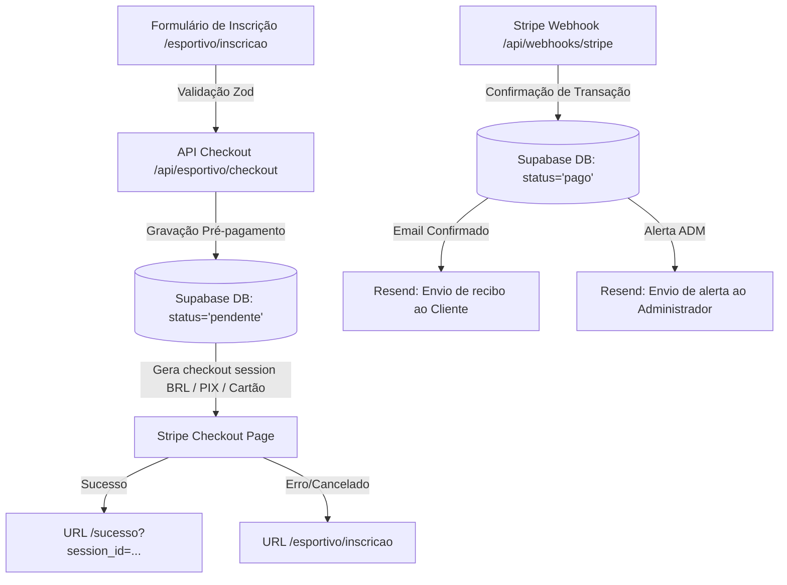

# 🏃‍♂️ Corrida pela Consciência 2026 — Plataforma de Inscrições e Vendas

Bem-vindo ao repositório oficial da **Corrida pela Consciência 2026**! Este projeto é uma solução premium de ponta a ponta desenvolvida em **Next.js 15 (App Router)** e **React 19**, projetada para oferecer uma Landing Page esportiva de altíssima conversão acoplada a um fluxo robusto de inscrições, pagamentos (Stripe), banco de dados (Supabase), emails transacionais (Resend) e painel administrativo de controle.

A **Corrida pela Consciência** é um evento esportivo beneficente focado na conscientização sobre saúde mental, realizado na orla de Florianópolis em 12 de julho de 2026. Parte da arrecadação é revertida diretamente para o **Instituto Reviva**.

---

## 🎨 Identidade Visual & Design System

A interface do usuário foi concebida sob uma estética escura (*dark mode*), esportiva e energética de alta costura, projetada para impressionar logo no primeiro contato (*wow factor*):

*   **Paleta de Cores Harmônica & Vibrante:**
    *   Fundo principal: Preto Profundo e Mineral (`#0B0B0C`, `#000000`, `bg-white/[0.02]`)
    *   Destaques primários: Amarelo/Verde Neon Altamente Energético (`#D6FF3F`)
    *   Acentos secundários: Laranja Fogo/Ação (`#FF5A1F`)
    *   Bordas e detalhes: Linhas sutis com opacidade (`border-white/10`, `border-white/15`)
*   **Par de Fontes Premium (Google Fonts):**
    *   **Anton:** Usada em headlines de impacto, em formato inteiramente maiúsculo (*uppercase*) e itálico, criando uma atmosfera veloz, imponente e moderna.
    *   **Inter:** Utilizada para textos corridos, tabelas e parágrafos, proporcionando leitura limpa e excelente legibilidade em qualquer dispositivo.
*   **Acessibilidade & UX (WCAG AA):**
    *   Alto contraste de cores para leitura sem esforço.
    *   Indicação visual de foco, navegação por teclado fluida e uso correto de tags semânticas do HTML5.
    *   Animações elegantes desenvolvidas nativamente em CSS puro (`globals.css`), respeitando as configurações de `prefers-reduced-motion`.

---

## 🧱 Arquitetura MPA (Multi-Page Application) de Alto Desempenho

Diferente de landing pages convencionais que são apenas arquivos estáticos ou SPAs monolíticos, o projeto foi arquitetado como um **MPA estático** de altíssima performance para garantir carregamento instantâneo, Core Web Vitals perfeitos e **SEO impecável**:

1.  **Overview de Seções (`/esportivo`):** Uma página longa que compõe todas as seções informativas do evento (Sobre, Percurso, Categorias, Kits, Cronograma e Motivos).
2.  **Páginas Individuais por Seção (`/esportivo/[secao]`):** Cada seção marcante da página principal é gerada estaticamente individualmente no build (`generateStaticParams`). Desta forma, rotas dinâmicas como `/esportivo/inscricao` têm seus próprios arquivos estáticos gerados com títulos (`<title>`), meta descrições (`description`) e títulos principais (`<h1>`) exclusivos para indexação massiva no Google.
3.  **Redirecionamento Inteligente (`/`):** O tráfego direcionado à raiz `/` é imediatamente roteado de forma nativa para `/esportivo`.

### 🛡️ Regra de Ouro da Arquitetura: Single Source of Truth
Para alterar qualquer conteúdo textual ou adicionar/remover seções na landing page, **edite exclusivamente o arquivo [sections.tsx](file:///c:/PASTA%20IMPORTANTE/TESCH_DEV/Landing_Page/esportivo/src/app/esportivo/sections.tsx)**.
As rotas individuais, barras de navegação, SEO e o [sitemap.ts](file:///c:/PASTA%20IMPORTANTE/TESCH_DEV/Landing_Page/esportivo/src/app/sitemap.ts) são auto-regenerados de forma 100% dinâmica com base no array exportado `sections` deste arquivo.

---

## 🚀 Fluxo de Inscrição e Pagamento (Stripe + Supabase)

O motor de conversão financeira da aplicação foi estruturado de forma hiper-segura para capturar leads e evitar qualquer perda de transações:



1.  **Captação de Informações (`/esportivo/inscricao`):** Formulário integrado com tabelas de tamanhos de camiseta detalhadas (Masculino e Feminino baby look). Coleta dados essenciais: Nome, Email, Telefone, CPF, Data de Nascimento, Gênero, Faixa Etária, Distância (5K, 10K, 21K), Tamanho de Camisa e Kit (Básico, Premium ou Embaixador).
2.  **Validação Segura (`zod`):** Validação rígida do input antes da inserção no banco e do início do pagamento através do schema `InscricaoSchema`.
3.  **Reserva de Lead no Supabase:** A inscrição é gravada no banco como `pendente` antes de direcionar o usuário para a interface de pagamento. Desta forma, o organizador nunca perde um contato de carrinho abandonado.
4.  **Stripe Checkout:** Criação de sessão de pagamento direta no Stripe em Reais (BRL), suportando **Cartão de Crédito** e **PIX** com links seguros.
5.  **Confirmação por Webhook (`/api/webhooks/stripe`):** O Stripe notifica nossa API de forma assíncrona. Validamos a assinatura criptográfica do webhook e, em caso de sucesso (`checkout.session.completed`), alteramos o status da inscrição para `pago` e registramos o horário e método de pagamento.
6.  **Emails Transacionais (`Resend`):** Envio instantâneo de um e-mail personalizado com os dados da inscrição para o competidor e um aviso de nova venda para o e-mail do administrador.

---

## 🔐 Painel Administrativo de Controle (`/esportivo/admin`)

O sistema conta com um painel de retaguarda completo e altamente visual para gerenciamento das vendas e inscrições:

*   **Login Seguro (`/esportivo/admin/login`):** Autenticação robusta gerida por cookies criptografados, impedindo acessos externos não autorizados.
*   **Métricas de Desempenho Físico e Financeiro:**
    *   **Total de Inscrições:** Contagem geral de cadastros.
    *   **Pagos:** Quantidade de inscritos confirmados que concluíram a transação.
    *   **Pendentes:** Contagem de transações que não finalizaram a cobrança.
    *   **Total Arrecadado:** Somatório monetário das inscrições confirmadas (formatado em BRL).
*   **Tabela Completa de Competidores:**
    *   Listagem em tempo real ordenada por data de criação.
    *   Filtros visuais dinâmicos de status (`pago`, `pendente`, `cancelado`) com cores intuitivas.
    *   Visualização simplificada de todos os metadados: ID, Prova (5K, 10K, 21K), Categoria (Gênero + Faixa Etária), Tamanho de Camiseta, Kit selecionado, CPF, e informações completas de contato (Telefone/Email).
    *   Integração direta com botão de Logout seguro.

---

## 🛠️ Stack Tecnológica

| Componente | Ferramenta / Biblioteca | Versão |
| :--- | :--- | :--- |
| **Framework Web** | Next.js 15 (App Router) | `^15.1.0` |
| **Biblioteca UI** | React 19 (Server Components) | `^19.0.0` |
| **Estilização** | Tailwind CSS 3 (Valores inline hex) | `^3.4.1` |
| **Segurança & BD** | Supabase JS client | `^2.45.4` |
| **Integração Financeira** | Stripe SDK | `^22.1.1` |
| **Emails Transacionais** | Resend SDK | `^6.12.3` |
| **Validação de Formulários** | Zod validation engine | `^4.4.3` |
| **Iconografia** | Lucide React | `^0.469.0` |
| **Linguagem** | TypeScript | `^5` |

---

## 📁 Estrutura de Diretórios Estratégica

```
esportivo/
├── .agents/                     # Instruções e habilidades dos agentes de IA
├── .claude/                     # Modelagem comportamental do Claude (obsoleto/legado)
├── supabase/
│   └── schema.sql               # Estrutura DDL da tabela no Supabase
├── src/
│   ├── app/                     # Roteador Next.js App Router
│   │   ├── api/                 # Endpoints REST Serverless
│   │   │   ├── checkout/        # Checkout legado (fluxo antigo /contratar)
│   │   │   ├── esportivo/       # APIs exclusivas da corrida
│   │   │   │   ├── admin/       # Autenticação de retaguarda
│   │   │   │   └── checkout/    # Início do Stripe da inscrição
│   │   │   └── webhooks/        # Escuta do webhook assíncrono do Stripe
│   │   ├── esportivo/           # CORE: Módulo da Corrida pela Consciência
│   │   │   ├── admin/           # Dashboard visual e tela de Login
│   │   │   ├── inscricao/       # Formulário e tabela de camisetas
│   │   │   ├── layout.tsx       # Nav, Footer e temas compartilhados
│   │   │   ├── page.tsx         # Overview composto pelas seções
│   │   │   └── sections.tsx     # SINGLE SOURCE OF TRUTH (dados/seções)
│   │   ├── contratar/           # Página de contratação de LPs (legado)
│   │   ├── sucesso/             # Rota de sucesso pós-checkout
│   │   ├── cancelado/           # Rota de cancelamento pós-checkout
│   │   ├── globals.css          # CSS Global + Fontes Anton/Inter + Keyframes CSS
│   │   ├── layout.tsx           # Layout raiz com fontes base
│   │   ├── page.tsx             # Redirecionador automático para /esportivo
│   │   └── sitemap.ts           # Sitemap automatizado para crawlers de SEO
│   ├── components/              # Componentes vivos e obsoletos (PricingSection)
│   ├── lib/                     # Conectores externos (Stripe, Resend, Supabase)
│   └── types/                   # Tipagens TS compartilhadas
```

---

## ⚙️ Variáveis de Ambiente (`.env.local`)

Crie um arquivo `.env.local` na raiz do projeto e configure as seguintes credenciais:

```env
# URL base do sistema
NEXT_PUBLIC_APP_URL=http://localhost:3000

# Stripe API Keys (Dashboard > Developers > API Keys)
STRIPE_SECRET_KEY=sk_test_51Px...                 # Chave secreta de homologação/teste
NEXT_PUBLIC_STRIPE_PUBLISHABLE_KEY=pk_test_51Px... # Chave pública de homologação/teste

# Segredo de assinatura de webhooks do Stripe
# (Em desenvolvimento: obtido no `stripe listen`. Em prod: configurado no webhook do Stripe)
STRIPE_WEBHOOK_SECRET=whsec_...

# Resend API Key (resend.com > API Keys)
RESEND_API_KEY=re_...
EMAIL_FROM=onboarding@resend.dev                   # Em prod: contato@seu-dominio.com.br
EMAIL_ADMIN=voce@seu-dominio.com.br                 # Email que receberá os alertas de novas vendas

# Supabase API Keys (Dashboard > Project Settings > API)
NEXT_PUBLIC_SUPABASE_URL=https://xxxx.supabase.co
SUPABASE_SERVICE_ROLE_KEY=eyJ...                    # IMPORTANTE: Use a service_role key para bypass de RLS

# Painel Administrativo (/esportivo/admin)
ADMIN_PASSWORD=SenhaForteDeSuaEscolha                # Senha de login para o dashboard
```

> [!WARNING]
> Nunca comite o arquivo `.env.local` para controle de versão. Ele é protegido e ignorado pelo `.gitignore`.

---

## 🚀 Instalação e Execução Local

Siga os passos abaixo para colocar a plataforma em execução na sua máquina local:

### 1. Clonar o projeto e instalar dependências
```bash
npm install
```

### 2. Configurar a Tabela no Supabase
Acesse o console do seu projeto Supabase, clique em **SQL Editor** > **New Query**, copie a estrutura contida no arquivo [supabase/schema.sql](file:///c:/PASTA%20IMPORTANTE/TESCH_DEV/Landing_Page/esportivo/supabase/schema.sql) e clique em **Run**.

Isso irá criar a tabela `inscricoes` pronta para cadastrar competidores, além de habilitar o **Row Level Security (RLS)** para impedir acesso público de leitura e escrita direto pelo navegador (todo o CRUD é realizado de forma ultra-segura através do nosso servidor via `service_role`).

### 3. Rodar o Servidor de Desenvolvimento
```bash
npm run dev
```
O projeto estará rodando localmente em: [http://localhost:3000](http://localhost:3000).

### 4. Testar o Webhook de Pagamento Localmente (Stripe CLI)
Para testar o fluxo de PIX e Cartão de ponta a ponta em ambiente de testes:
1.  Baixe e instale a **Stripe CLI** no seu computador.
2.  Inicie sessão digitando no seu terminal:
    ```bash
    stripe login
    ```
3.  Inicie o redirecionamento local de eventos para a sua rota local:
    ```bash
    stripe listen --forward-to localhost:3000/api/webhooks/stripe
    ```
4.  A CLI imprimirá um código iniciante em `whsec_...`. Copie este valor e cole na chave `STRIPE_WEBHOOK_SECRET` do seu arquivo `.env.local`.
5.  Reinicie o servidor local (`npm run dev`) e realize uma inscrição de teste para ver o fluxo completar com sucesso!

---

## 🏗️ Validação e Build de Produção

Antes de enviar o código para o servidor ou Vercel, é mandatório testar a tipagem estatística e a compilação completa para verificar possíveis corrupções:

```bash
# Verificar erros de compilação de TypeScript
npx tsc --noEmit

# Apagar caches e testar compilação limpa do Next.js
rm -rf .next && npm run build
```

As rotas dinâmicas do MPA em `/esportivo/[secao]` devem aparecer como marcadas com `● (SSG)` com suas páginas estáticas pré-renderizadas. As APIs em `/api/*` devem compilar como `ƒ (Dynamic)`.

---

## 📈 Checklist para Colocação em Produção

Ao migrar o projeto para a conta definitiva do cliente, certifique-se de realizar:

- [ ] Substituir as chaves de teste (`sk_test`, `pk_test`) do Stripe pelas chaves **LIVE** da conta do cliente (`sk_live`, `pk_live`).
- [ ] Ativar o Webhook no dashboard do Stripe apontando para a URL real de produção: `https://seu-dominio.com.br/api/webhooks/stripe`, habilitando o evento `checkout.session.completed`. Atualizar a chave `STRIPE_WEBHOOK_SECRET` no servidor com o novo segredo gerado pelo Stripe Dashboard.
- [ ] Adicionar e validar o domínio oficial do cliente no painel da **Resend** para usar um email de remetente profissional (ex: `inscricoes@corrida.com.br`) ao invés do email temporário `onboarding@resend.dev`.
- [ ] Configurar a variável `NEXT_PUBLIC_APP_URL` na plataforma de hospedagem (Vercel, Netlify, etc.) apontando para o domínio definitivo do cliente.
- [ ] Modificar a chave `ADMIN_PASSWORD` com uma senha de alta complexidade nas variáveis de ambiente do servidor.
- [ ] Criar o arquivo `robots.txt` para regular a indexação dos crawlers de forma ideal no ambiente público.

---

## 🤝 Créditos e Contribuições

Este boilerplate de multi-templates foi simplificado para focar unicamente no segmento esportivo. A manutenção e adição de novos blocos visuais devem seguir os padrões de Server Components e Tailwind descritos na especificação oficial do projeto.